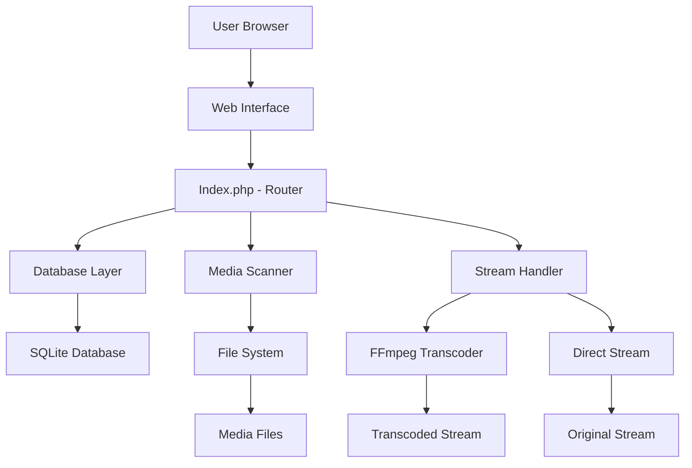
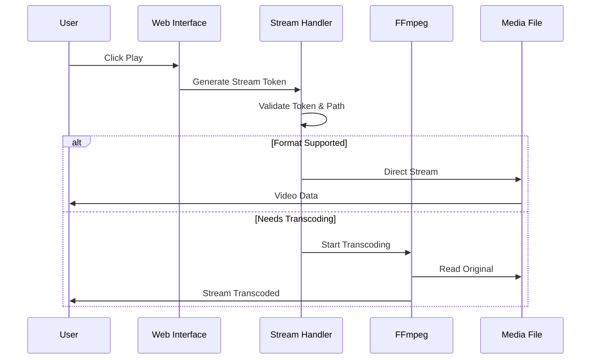

# xsukax Media Server


A self-hosted, privacy-focused media streaming server that allows you to stream your personal movie and TV show collections from your own server with full control over your data.

## 🎬 Project Overview

xsukax Media Server is a lightweight, PHP-based media streaming solution that transforms your personal media library into a private Netflix-like experience. Built with privacy and simplicity in mind, it enables you to:

- **Stream media securely** from your own server without third-party dependencies
- **Organize collections** automatically with smart filename parsing
- **Transcode on-the-fly** for broad device compatibility
- **Maintain full ownership** of your data and viewing habits

### Key Functionalities
- Web-based media browser with responsive design
- Automatic library scanning and metadata extraction
- Support for 30+ video formats with fallback transcoding
- TV show season/episode detection and organization
- Subtitle support (SRT, VTT, ASS, SSA, SUB)
- Continue watching and play history tracking
- Search functionality across entire library
- Mobile-friendly interface with keyboard controls

## 🔒 Security and Privacy Benefits

### Zero Data Sharing
- **No telemetry or analytics** - Your viewing habits stay private
- **No third-party APIs** - Metadata is extracted from filenames, no external calls
- **Local database only** - All data stored in SQLite on your server

### Secure Streaming
- **Token-based authentication** - Prevents unauthorized media access
- **Path validation** - Restricts file access to configured directories only
- **Input sanitization** - Protects against path traversal attacks
- **Session-based access** - Configurable timeout for security

### Privacy by Design
- **Self-hosted architecture** - You control the infrastructure
- **No user tracking** - Viewing history is stored locally only
- **Offline capability** - Works completely without internet access
- **Ad-free experience** - No embedded advertisements or tracking pixels

## ✨ Features and Advantages

### 🎯 Core Features
- **Multi-format Support**: MP4, MKV, AVI, MOV, WMV, FLV, WebM, and 25+ other formats
- **Smart Library Management**: Automatic movie/TV show detection and organization
- **Transcoding Engine**: FFmpeg integration for format compatibility
- **Responsive Design**: Works on desktop, tablet, and mobile devices
- **Keyboard Controls**: Space (play/pause), F (fullscreen), M (mute), arrow keys (seek)

### 🚀 Unique Advantages
- **Lightweight**: Single-file PHP application, no complex dependencies
- **Easy Setup**: Drop-in installation, minimal configuration required
- **Resource Efficient**: Low memory footprint, suitable for Raspberry Pi
- **Customizable**: Open source with modular architecture
- **Privacy First**: No external dependencies or data leaks

## 📥 Installation Instructions

### Prerequisites
- PHP 8.0 or higher with extensions: `pdo_sqlite`, `fileinfo`
- Web server (Apache/Nginx) with URL rewriting enabled
- FFmpeg (optional, for transcoding support)
- 100MB+ disk space for application and database

### Step-by-Step Installation

1. **Download and Extract**
```bash
cd /var/www/html
git clone https://github.com/xsukax/xsukax-Media-Server.git
cd xsukax-Media-Server
```

2. **Set Permissions**
```bash
chmod 755 ./
chmod 755 media/ movies/ shows/
```

3. **Configure Web Server**
```apache
# Apache .htaccess (included)
RewriteEngine On
RewriteCond %{REQUEST_FILENAME} !-f
RewriteCond %{REQUEST_FILENAME} !-d
RewriteRule ^(.*)$ index.php [QSA,L]
```

4. **Verify Installation**
Visit `http://your-server/xsukax-media-server/` in your browser.

## 📖 Usage Guide

### Initial Setup

1. **Configure Media Folders**
Edit `config.php` to set your media directories:
```php
define('MOVIES_PATH', __DIR__ . '/media/movies');
define('SHOWS_PATH', __DIR__ . '/media/shows');
```

2. **Organize Your Media**
```
media/
├── movies/
│   ├── The Matrix (1999).mp4
│   └── Inception (2010).mkv
└── shows/
    └── Breaking Bad/
        ├── Season 1/
        │   ├── S01E01.mp4
        │   └── S01E02.mkv
        └── Season 2/
            └── S02E01.avi
```

3. **Scan Your Library**
Click the "Scan" button in the web interface to populate your library.

### Application Architecture



### Streaming Process Flow



### Common Operations

**Adding New Media**
1. Place files in appropriate folders
2. Use consistent naming: `Movie Name (Year).ext` or `Show Name/Season X/Episode.ext`
3. Run library scan from web interface

**Customizing Metadata**
1. Navigate to media item details
2. Click "Edit" to modify title, year, genre, description
3. Add poster URLs or IMDb IDs for enhanced display

**Mobile Streaming**
- Responsive design adapts to screen size
- Touch-friendly controls
- Adaptive bitrate streaming for varying network conditions

## 📄 Licensing Information

This project is licensed under the **GNU General Public License v3.0**.

### What GPLv3 Means for You:

**Freedom to Use**: Run the software for any purpose
**Freedom to Study**: Access and examine the source code
**Freedom to Modify**: Adapt and change the software to meet your needs
**Freedom to Share**: Distribute original or modified versions

### Key Requirements:
- **Source Code Availability**: Any distributed copies must include source code
- **License Preservation**: Modifications must remain under GPLv3
- **Copyright Notice**: Original copyright and license notices must be preserved
- **Same License**: Derived works must use GPLv3

For complete license terms, see the [LICENSE](LICENSE) file or visit [GNU GPL v3.0](https://www.gnu.org/licenses/gpl-3.0.html).

## 🤝 Contributing

Contributions are welcome! Please feel free to submit a Pull Request. For major changes, please open an issue first to discuss what you would like to change.

## 🐛 Troubleshooting

Common issues and solutions:

**Media Not Showing After Scan**
- Check file permissions in media directories
- Verify supported file formats
- Ensure filenames follow naming conventions

**Playback Issues**
- Install FFmpeg for transcoding support
- Check PHP memory limits in php.ini
- Verify file isn't corrupted

**Performance Problems**
- Enable OPcache for PHP
- Consider hardware transcoding
- Use SSD storage for media files
---

**xsukax Media Server** - Stream Your World, Your Way. 🎥✨
